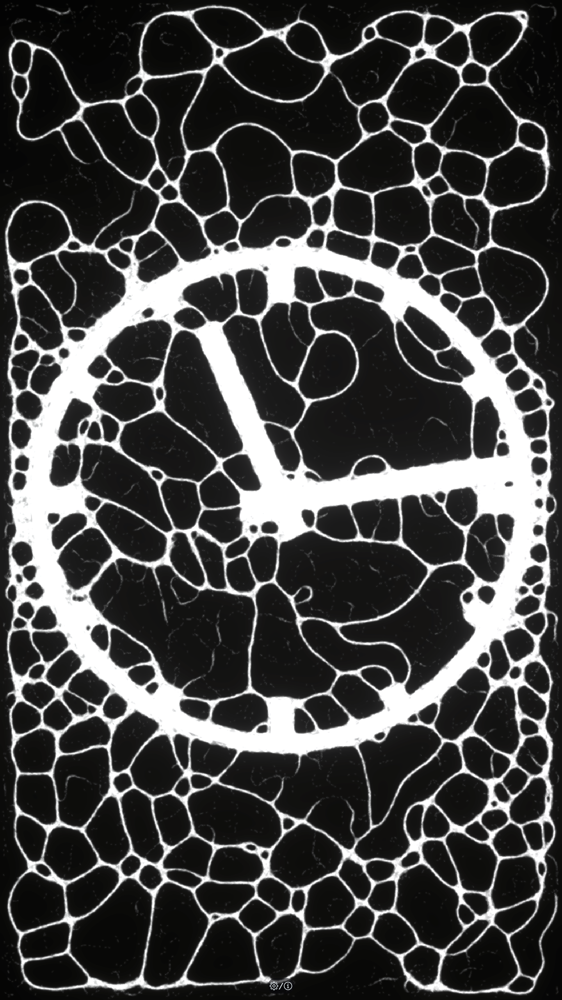
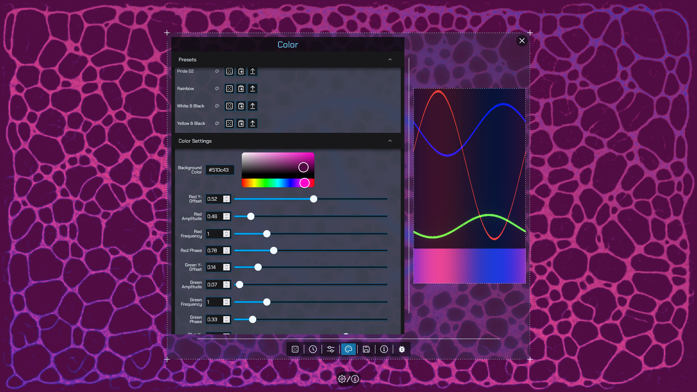
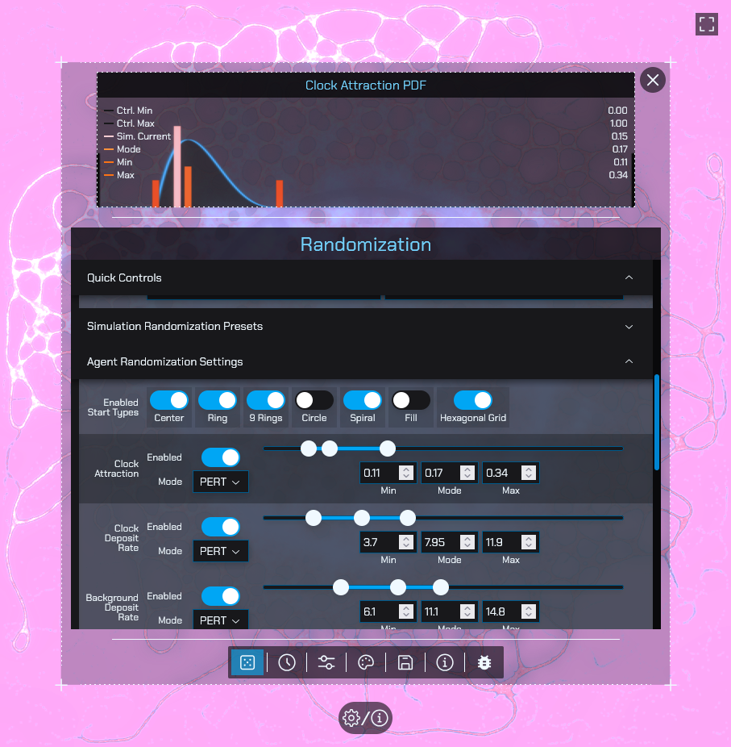
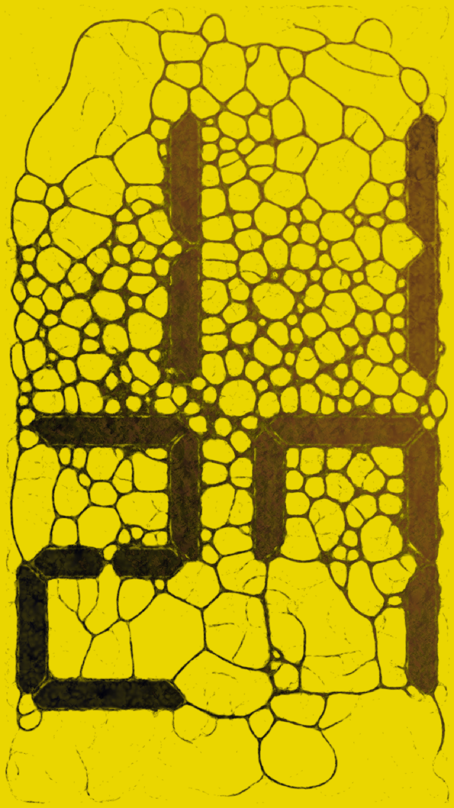

# Slime Clock

## Information

It's a slime mold simulation. It's a clock. It runs in your browser (probably). Technically works on mobile too, though the UI is a bit buggy there.

Heavily inspired by Sebastian Lague's [Coding Adventure: Ant and Slime Simulations](https://www.youtube.com/watch?v=X-iSQQgOd1A) video. Seriously though, go watch that video. It's interesting (if you're into this sort of stuff), plus this project uses much of the same terminology that he uses in the video.

Special thanks to [Iñigo Quílez](https://iquilezles.org/) for his extensive shader references, and [Bruno Simon](https://threejs-journey.com/) for his Three.js Journey course.

Feel free to open issues or submit pull requests if you have suggestions or improvements.

## Screenshots

(All good repos have screenshots)

